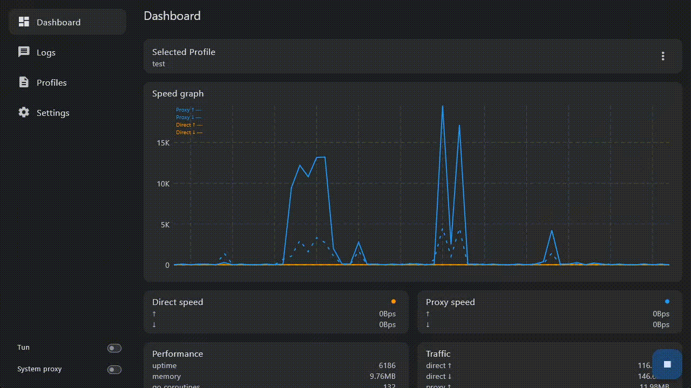
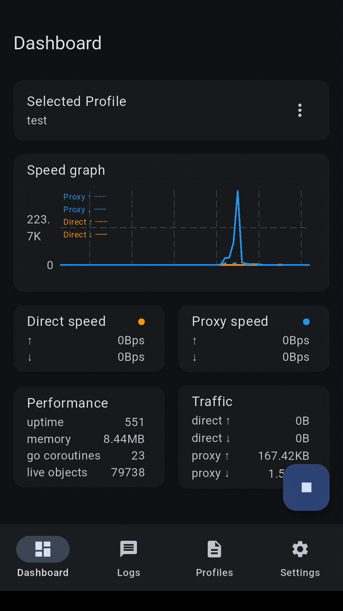

# AnyPortal

> [!IMPORTANT]
> **Seeking Apple Development Collaborator**
> 
> We're looking for a partner with a paid Apple Developer Program account who can take part in building (and publishing) the iOS version of our project.
> 
> If the Network Extension entitlement is not yet enabled, it will need to be requested through Apple.
> 
> Please reach out via the email listed in our Git commit history.
> 
> 2025-08-10

 

- v2ray, xray, sing-box, clash, mihomo... GUI for Windows, macOS, Linux, Android, (iOS currently blocked).
- Typically used in combination with a core (v2ray-core, xray-core, sing-box, etc)
- Multilingual support: العربية, Deutsch, English, Español, فارسی, Français, हिन्दी, Bahasa Indonesia, 日本語, 한국어, Português, Русский, ไทย, Türkçe, Tiếng Việt, 中文

## Download latest release

<table>
  <thead align=left>
    <tr>
      <th>OS</th>
      <th>Download</th>
    </tr>
  </thead>
  <tbody align=left>
    <td>Android</td>
      <td>
         
         
         
        <!--  
         
          -->
      </td>
    </tr>
    <tr>
      <td>Windows</td>
      <td>
         
         
      </td>
    </tr>
    <tr>
      <td>macOS</td>
      <td>
         
      </td>
    </tr>
    <tr>
      <td>Linux</td>
      <td>
         
      </td>
    </tr>
    <tr>
      <td>iOS</td>
      <td>
        currently blocked 
      </td>
    </tr>
  </tbody>
</table>

## Dev roadmap

|              |                  | Windows | Linux | macOS | Android | iOS |
| ------------ | ---------------- | ------- | ----- | ----- | ------- | --- |
| AnyPortal    |                  | 🟢       | 🟢     | 🟢     | 🟢       | 🔵   |
| core         | of exec          | 🟢       | 🟢     | 🟢     | 🟢¹      | ⚫   |
|              | of lib           | ⚫       | ⚫     | ⚫     | 🟢²      | 🟢   |
| tun          | via root         | 🟢³      | 🟢⁴    | 🟢⁵    | 🟢¹      | ⚫   |
|              | via platform api | ⚫       | ⚫     | 🔴⁶    | 🟢       | 🔴⁶  |
| system proxy |                  | 🟢       | 🟢⁷    | 🟢     | 🟢⁸      | ⚫   |
<!-- ⁰ ¹ ² ³ ⁴ ⁵ ⁶ ⁷ ⁸ ⁹ ⸴ -->
1. Require `api28` variant, not available for play store `apilatest` version.
   - The core exec asset is copied to internal storage upon selection, so you MUST reselect the core if you want to update it.
   - The `working directory` can not be set to a location without execution permission, e.g. the sdcard which has a FAT file system.
   - You MUST manually specify the `envs` if the core needs it, e.g. `{"xray.location.asset" : "/storage/emulated/0/path/to/xray/assets"}`
2. Using xray-core v1.250608.0.
3. Require `Run as Administrator`, elevated user share configuration with original user
4. Require root, root DOES NOT share configuration with original user
5. Require root, root DOES NOT share configuration with original user. Move the app to Application folder and run `sudo /Applications/AnyPortal.app/Contents/MacOS/AnyPortal`.
6. Require an apple developer license to even debug an app that uses Network Extension. Dev progress currently blocked. The iOS app would serve little purpose right now without tun.
7. Tested on Ubuntu 24.04 with Gnome
8. Require root

- ⚫ Not Planned: impossible / no plans / discontinued
- 🟡 Planned: planned / under development
- 🔵 Experimental: experimental implementation / testing
- 🟢 Working: functioning as expected
- 🔴 Not Working: dev blocked / known issues / non-functional

See planning [here](https://github.com/users/anyportal/projects/1/views/1).

## Supported cores

|              | config injection | dashboard info |
| ------------ | ---------------- | -------------- |
| v2ray/xray   | 🟢                | 🟢              |
| sing-box     | 🟢                | 🟢²             |
| clash/mihomo | 🟢                | 🟢              |
| hysteria2    | 🔵                | ⚫              |
| ...¹         | ...              |                |

1. In theory one can run any cores, however it won't be a good experience without config injection and dashboard info. PR welcomed for additional core support. See `lib/utils/core` for example.
2. Using clash api, since v2ray-api is not enabled in official release.

## Technical details for power users

- ~~why v2ray/xray over sing-box?~~ Why choose one when you can have any?
  - seriously, why v2ray/xray over sing-box?
    - load balancing
    - chained proxy in transport layer
    - better server-side functions (gRPC interface etc.), so we choose it also as client to reduce maintenance
  - why sing-box over v2ray/xray?
    - integrated tun makes things easier
- remote profile has only one required field, a REST URL pointing to a v2ray config
- for v2ray to work properly on Android and iOS, Tun2socks is necessary
  - v2ray native tun inbound is only half finished for now
  - Tun2socks with best performance so far: hev-socks5-tunnel, followed by sing-box
  - you can use anyportal with tun disabled on Android, and use external tools to redirect traffic to a socks port, just like on desktop
- android api 29+ does not allow running binary directly
  - you can run custom cores (any version of v2ray, xray) with apk compiled with api target 28
  - play store always requires recent api targets, way over 28 now, so you can only use an embedded core with playstore apk
- why do I need tun via root or system proxy on Android?
  - Tun2socks via sing-box is actually faster than hev-socks5-tunnel on web page opening, which currently needs root access
  - there are apps actively detecting if you are using VPN
- what are "assets" and why do I need / how do I use them?
  - AnyPortal facilitates auto updates through remote assets, i.e., GitHub releases. Core executables, even rule set files, can be auto-updated this way. Local files can be used directly of course, as local assets.
  - here are some common examples for remote assets
    - `github://xtls/xray-core/Xray-android-arm64-v8a.zip/xray`
    - `github://v2fly/v2ray-core/v2ray-windows-64.zip/v2ray.exe`
    - `github://v2fly/domain-list-community/dlc.dat`
  - on Android this gets a little more complicated. Remote assets have no problem - they are downloaded directly into internal storage. For local files (those you can access, typically on your `/sdcard`, i.e., external storage, where the default `Downloads` folder resides), executables must be copied to internal storage (where you have no access) so that they can run. For this reason, when you choose a local file, AnyPortal copies it to internal storage for you. This may break assets dependency, so you may want to specify core environment variables to tell the core where to find its dependencies, e.g. `{"xray.location.asset":"/sdcard/path/to/your/geosite-folder"}`, `{"V2RAY_LOCATION_ASSET":"/data/data/com.github.anyportal.anyportal/files/asset/github/v2fly/domain-list-community"}`. Do not try to set the working directory to a sdcard path, it won't work.

## License

All rights reserved until further notice (hopefully soon).

## Thanks

### 3rd party libs used in the project

- [v2fly/v2ray-core](https://github.com/v2fly/v2ray-core), MIT
- [xtls/xray-core](https://github.com/xtls/xray-core), MPL-2.0
- [heiher/hev-socks5-tunnel](https://github.com/heiher/hev-socks5-tunnel), MIT

### Inspired by, or related to, but not used in the project

- [Qv2ray/Qv2ray](https://github.com/Qv2ray/Qv2ray), GPL-3.0
- [SagerNet/sing-box](https://github.com/SagerNet/sing-box), GPL

### Toolchains

- [flutter/flutter](https://github.com/flutter/flutter), BSD-3-Clause
  - a full list of flutter dependency can be found in `./pubspec.yaml`
- [jrsoftware/issrc](https://github.com/jrsoftware/issrc), Inno Setup License

## Support development

coming soon

## Final words

  

> "You take the blue pill, the story ends, you wake up in your bed and believe whatever you want to believe. You take the red pill, you stay in Wonderland and I show you how deep the rabbit hole goes."  
>
> — Morpheus, *The Matrix* (1999)

We hope you choose well between your home world and Wonderlands.
