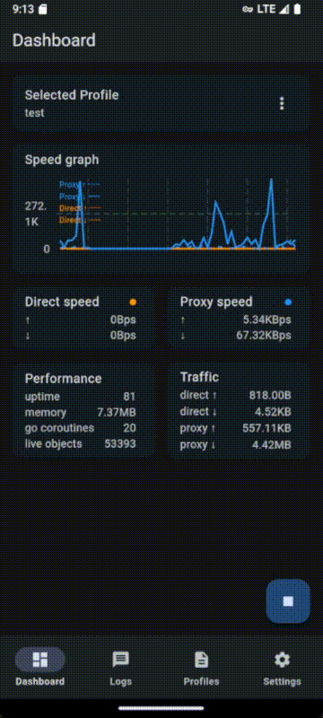

# fv2ray

   

- Free/Flutter v2ray GUI for Windows, macOS, Linux, Android, (iOS currently blocked).
- Typically used in combination with a v2ray-core (or xray-core and alike)

## Download latest release

<table>
  <thead align=left>
    <tr>
      <th>OS</th>
      <th>Download</th>
    </tr>
  </thead>
  <tbody align=left>
    <td>Android</td>
      <td>
         
         
      </td>
    </tr>
    <tr>
      <td>Windows</td>
      <td>
         
      </td>
    </tr>
    <tr>
      <td>macOS</td>
      <td>
         
      </td>
    </tr>
    <tr>
      <td>Linux</td>
      <td>
         
      </td>
    </tr>
  </tbody>
</table>

> [!WARNING]
> This project is currently in its early alpha stage and may exhibit instability during execution. User preferences may not be retained in the final release, and the API is subject to change without prior notice. Please use this software at your own risk. 
> 2024-09-27

> [!IMPORTANT]
> iOS development is currently blocked. iOS app using Network Extension requires a paid Apple Developer Program membership ($99/year) to debug even on our own devices, which is not available for the developers right now.

## Technical details for power users

- why v2ray/xray over sing-box?
  - load balancing
  - chained proxy in transport layer
  - better server-side functions (gRPC interface etc.), so we choose it also as client to reduce maintenance
- remote profile has only one required field, a REST URL pointing to a v2ray config
- for v2ray to work properly on Android and iOS, tun2socks is necessary
  - v2ray native tun inbound is only half finished for now
  - tun2socks with best performance so far: hev-socks5-tunnel
  - you can use fv2ray with tun disabled on Android, and use external tools to redirect traffic to a socks port, just like on desktop
- android api 29+ does not allow running binary directly
  - you can run custom cores (any version of v2ray, xray) with apk compiled with api target 28
  - playsotore always requires recent api targets, way over 28 now, so you can only use an embedded core with playstore apk

## Todo

|        | Windows | Linux | macOS | Android | iOS |
| ------ | ------- | ----- | ----- | ------- | --- |
| fv2ray | ✅       | ✅     | ✅     | ✅       | ❌   |
| tun    | 🔜       | 🔜     | 🔜     | ✅       | ❌   |

- 💤 Not Planned: No plans for implementation or discontinued
- 🔜 Planned: Planned for future development
- 🚧 In Progress: Partially implemented, but not fully functional yet
<!-- - 🛠 Under Development: Actively being worked on -->
<!-- - 🧪 Experimental: Under experimental implementation or testing -->
<!-- - ⏳ Awaiting Review: Needs testing or review -->
<!-- - 📝 Documenting: In the process of being documented -->
- ✅ Working: Completed and functioning as expected
- ❌ Not Working: Known issues, broken or currently non-functional

- [ ] assets build
- [ ] assets auto update
- [ ] core auto update
- [ ] auto core version
- [ ] auto connect last session
- [ ] license
- [ ] profiles: group
- [ ] profiles: group bulk action
- [ ] profiles: subscription
- [ ] profile: tcping
- [ ] profile: remote auto update
- [ ] Android custom core restart prompt
- [ ] better log and hints
- [ ] document

## License

All rights reserved until further notice (hopefully soon).

## Thanks

- [v2fly/v2ray](https://github.com/v2fly/v2ray-core), [xtls/xray](https://github.com/xtls/xray-core)
- [flutter](https://flutter.dev/) and all its awesome plugins
- [heiher/hev-socks5-tunnel](https://github.com/heiher/hev-socks5-tunnel)

## Support development

coming soon

## Final words

  

> "You take the blue pill, the story ends, you wake up in your bed and believe whatever you want to believe. You take the red pill, you stay in Wonderland and I show you how deep the rabbit hole goes."  
>
> — Morpheus, *The Matrix* (1999)

We hope you choose well between your home world and Wonderlands.
